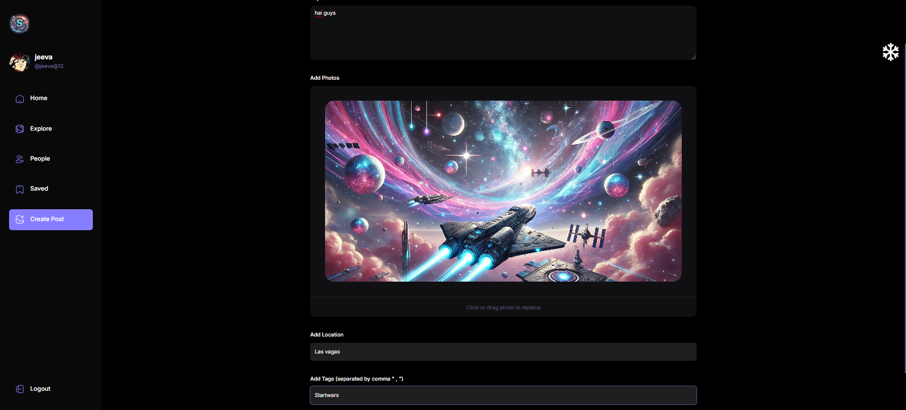

# 🌌 **SocialVerse**  

Welcome to **SocialVerse**, a modern social media platform crafted to deliver seamless interactions and engaging user experiences. Built with cutting-edge technologies and a scalable backend, this project showcases the fusion of robust functionality and sleek design.  

---

## 🚀 **Key Features**  

- **🔒 User Authentication**  
  Secure login and signup functionality powered by token-based authentication.  

- **✍️ Post Creation & Interaction**  
  Users can create posts, comment, and engage with likes for dynamic social interaction.  

- **⚡ Real-time Updates**  
  Real-time notifications and interactions enabled through modern frameworks.  

- **📱 Responsive Design**  
  Optimized for flawless usability on both desktop and mobile devices.  

- **☁️ Deployed on AWS Amplify**  
  Demonstrating serverless architecture with auto-scaling and CI/CD pipelines.  

---

## 🛠️ **Tech Stack**  

- **Frontend**: React/TypeScript for highly interactive user interfaces.  
- **Backend**: Web API services and TanStack Query for robust and scalable backend operations.  
- **Hosting/Deployment**: AWS Amplify ensures seamless scaling and CI/CD integration.  

---

## 📸 **Screenshots**  

### 🏠 **Homepage View**  
  

### 🖼️ **Post Interaction Page**  
  

### 💻 **Responsive Design Example**  
  

---

## 🌐 **Deployment Link**  

🚀 Explore the live app here: [**SocialVerse Live App**](https://main.d24v2clqh5zmxw.amplifyapp.com/)  

---

## 🛡️ **Environment Variables Setup**  

Before running the project locally, ensure you configure the `.env.local` file with the required variables:  

```bash
# Appwrite Configuration  
VITE_APPWRITE_URL=<Your Appwrite Endpoint URL>  
VITE_APPWRITE_PROJECT_ID=<Your Project ID>  
VITE_APPWRITE_STORAGE_ID=<Your Storage Bucket ID>  
VITE_APPWRITE_DATABASE_ID=<Your Database ID>  
VITE_APPWRITE_SAVES_COLLECTION_ID=<Your Saves Collection ID>  
VITE_APPWRITE_USER_COLLECTION_ID=<Your User Collection ID>  
VITE_APPWRITE_POST_COLLECTION_ID=<Your Post Collection ID>  
