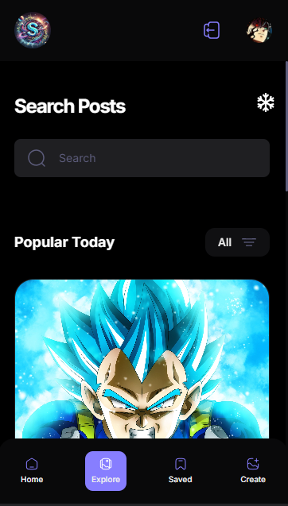

# SocialVerse

SocialVerse is a modern social media platform designed to provide users with seamless interaction capabilities. It combines cutting-edge UI/UX elements with a scalable backend architecture to deliver an engaging user experience.

---

## Key Features

- **User Authentication**:  
  Secure login and signup functionality with token-based authentication.

- **Post Creation & Interaction**:  
  Users can create posts, comment, and engage with likes.

- **Real-time Updates**:  
  Leveraging modern frameworks for real-time interactions like notifications or chat.

- **Responsive Design**:  
  Optimized for both desktop and mobile views.

- **Deployed on AWS Amplify**:  
  Showcasing serverless deployment, auto-scaling, and CI/CD pipelines.

---

## Tech Stack

- **Frontend**: React/TypeScript for dynamic user interfaces.
- **Backend**:  Web API  services.
- **Hosting/Deployment**: AWS Amplify ensures efficient scaling and CI/CD integration.

---

## Screenshots

- **Homepage View**:  
  Add an image of the homepage here.  
  )

- **Post Interaction Page**:  
  Add an image showing the post interaction feature.  
  
)

- **Responsive Design Example**:  
  Show the platform on desktop and mobile.  
  

---

## Deployment Link

Check out the live version here: [SocialVerse Live App](https://main.d24v2clqh5zmxw.amplifyapp.com/)

---

## Use Cases

- Social networking for individuals and communities.
- Content sharing and public engagement.
- Scalable platform for deploying advanced features like media sharing or group interactions.

---

## How to Run Locally

1. Clone the repository:
   ```bash
   git clone https://github.com/arnold-1324/SocialVerse.git

